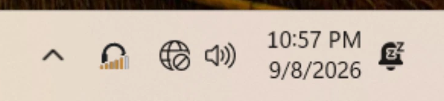
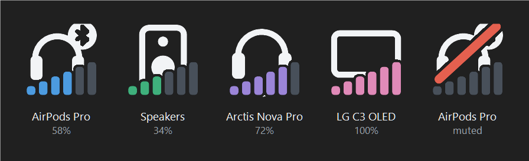
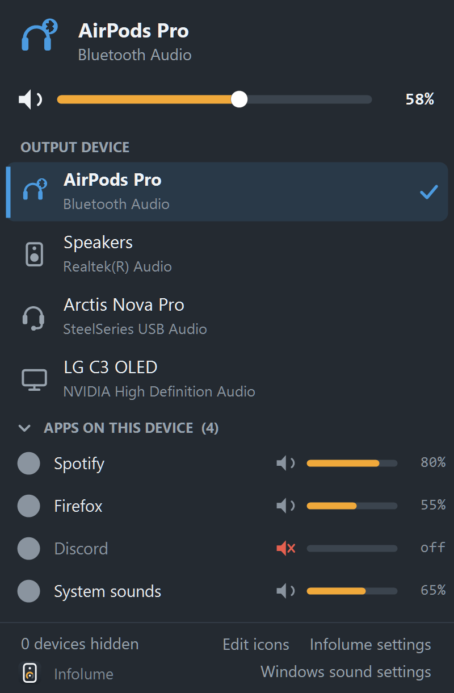

# Infolume

**A Windows 11 tray icon that shows which device your sound is going to, and how
loud.**

The stock volume icon looks the same whether sound is going to your speakers,
your headphones or your TV. With one output that rarely matters. With six, half
of them virtual, finding out means opening the flyout.

<p align="center">
  
</p>

Infolume is the headphones on the left. The stock volume icon is three along.

**The icon changes with the device.** Switch to your headset and the taskbar
shows a headset. Connect earbuds and it shows earbuds. Display glasses show as
glasses rather than as a television.

Each device keeps its own colour, derived from its ID, so two endpoints both
named "Speakers" stay distinguishable. The volume level is drawn across the
glyph.

<p align="center">
  
</p>

A red slash marks silence, at zero as well as when muted, because the two sound
identical.

One left-click opens the panel: the device list, and a mixer for whatever is
playing. Clicking a device switches every role at once, so applications do not
end up split across two outputs. Scrolling over the icon adjusts the volume.

<p align="center">
  
</p>

## Requirements

Windows 11. The default download needs nothing else installed; the .NET runtime
is bundled into the executable.

Developed and tested against Windows 11 with both the stock taskbar and
StartAllBack 3.9.25.

## Getting it

Two downloads on the [Releases page](https://github.com/kinyeka-labs/infolume/releases/latest).
Both are the same application and differ only in whether the .NET runtime travels
inside the executable. Each zip contains the executable and the licence.

| Download | Size | Requires |
|---|---|---|
| **`Infolume-x.y.z-win-x64-includes-dotnet10.zip`** | ~42 MB | nothing. Take this one if unsure |
| `Infolume-x.y.z-win-x64-requires-dotnet10.zip` | ~0.7 MB | the [.NET 10 Desktop Runtime](https://dotnet.microsoft.com/download/dotnet/10.0) |

Extracted, the executables are ~48 MB and ~2.1 MB. The difference is the .NET
runtime and the WinForms stack, bundled into the larger one.

The small build needs the .NET 10 **Desktop** Runtime specifically, not the plain
runtime or the ASP.NET one. Without it, Windows shows "You must install or update
.NET to run this application" with a Download it now button. To install it first:

```powershell
winget install Microsoft.DotNet.DesktopRuntime.10
```

Infolume does not install that runtime itself. It makes no network connections of
any kind.

The binaries are not code-signed, so verify your download against the SHA-256 in
`SHA256SUMS.txt` beside them:

```powershell
(Get-FileHash Infolume-0.1.2-win-x64-includes-dotnet10.zip -Algorithm SHA256).Hash
```

Copy `Infolume.exe` somewhere permanent and run it. `%LOCALAPPDATA%\Infolume` is
a sensible home. The Releases page lists what is in each version.

To start it at sign-in, right-click the tray icon and choose **Start with
Windows**. That writes an `HKCU\...\Run` entry, needs no administrator rights,
and appears in Task Manager's Startup tab.

### Building from source

Needs the [.NET 10 SDK](https://dotnet.microsoft.com/download):

```bash
pwsh ./build.ps1
```

That produces the same ~48 MB `dist/selfcontained/Infolume.exe`. Do not run it
from `dist/`; the next build overwrites it. A build from source is not subject to
the SmartScreen warning below.

To produce both downloads and their checksums as a release ships them:

```bash
pwsh ./build.ps1 -Mode Both -Package
```

## Windows will warn you the first time

Infolume is not code-signed, so SmartScreen shows **"Windows protected your PC"**
on first run. To get past it: **More info → Run anyway**. A signing certificate
costs money annually and this is a free utility. The warning means Windows does
not recognise the publisher, not that it found anything wrong.

**On antivirus.** 0.1.0 installed a global `WH_MOUSE_LL` hook for
scroll-over-the-icon, the same Windows API an input logger uses, which some
scanners score on the call alone. 0.1.1 removed it. There is no
`SetWindowsHookEx` call anywhere in the code, for the mouse or anything else.

The wheel is read with Raw Input, which can observe input but cannot block or
alter it. That change was made after measuring that nothing else on either
taskbar acts on a scroll over the icon.

Scroll-to-adjust can also be switched off in settings. With it off the app makes
no raw-input registration at all, which the `--log` output confirms. Everything
else keeps working.

## Using it

- **Left-click the icon** for the panel: the active device, a master volume
  slider, the full device list, and the apps currently playing. Click any device
  to switch to it; each app row has its own slider and mute.
- **Scroll over the icon** to change the volume, with a readout that fades.
  Scrolling over the open panel does the same without the readout. Can be
  switched off in settings.
- **Right-click a device row**, or click its gear, to rename it, change its glyph
  and colour, or hide it from the list.
- **Right-click the icon** for settings, **Start with Windows**, and exit.

The icon shows a red slash whenever there is no sound, for mute and for zero
volume alike. The tooltip and the scroll readout distinguish the two.

## Renaming a device

Renames are **local to Infolume**. It shows your name for a device; the rest of
Windows carries on using the original. The adapter line under each device is
never substituted, so a rename cannot hide which physical device a row refers to.

On many machines several endpoints report the same name. Two different devices
both called "Speakers" is common, and telling them apart is what renaming is for.

## Settings

Right-click the icon → **Infolume settings**. Each option sits next to a live
preview.

- **Icon size.** Override it if the icon looks soft or squashed. Needed with
  replaced taskbars, which size their tray slots themselves and report it to
  nobody.
- **Light/dark.** Follows the system theme by default. Override it if your
  taskbar does not match the system setting.
- **Level indicator.** The staircase is the default; there are also bars,
  segments, a column, an arc and pips, plus a step count.
- **Scroll over the icon to change volume.** On by default. Off means Infolume
  makes no raw-input registration at all.
- **Scroll step.** How far one wheel notch moves the volume.

Per-device glyph, colour and visibility live in the device editor: right-click a
device row.

## Replaced taskbars

Developed against StartAllBack in `LegacyTaskbar` mode.

On a replaced taskbar Windows does not report where an app's own tray icon is.
Infolume learns the position from your cursor the first time you hover the icon.
If scroll-to-adjust does not work immediately after a restart or a resolution
change, hover over the icon once.

## Uninstall

Delete the executable and the `%APPDATA%\Infolume` folder. If you enabled
autostart, turn it off from the tray menu first, or remove the `Infolume` value
under `HKCU\SOFTWARE\Microsoft\Windows\CurrentVersion\Run`.

Nothing else is written anywhere. No services, no drivers, no scheduled tasks.

## Known gaps

- Not code-signed, so the SmartScreen warning above.
- No custom `.ico`/`.png` per device. The glyph set is what there is.
- No dragging an app row onto a device to move its audio.
- No global hotkeys.

## Licence

[MIT](LICENSE). Do what you like with it; keep the copyright notice.

The one dependency, [NAudio](https://github.com/naudio/NAudio) 3.1.0, is MIT too,
so a self-contained build carries nothing more restrictive than this repo does.
